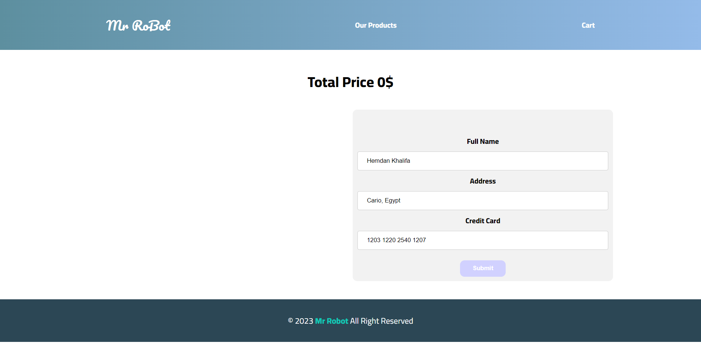

# MyStore Project

## Getting Started

## Scripts

1. npm run server
2. npm run test
3. npm run start
4. npm run build

# First

You should run this command to install all the dependencies needed for this application

```
npm i

```

# Backend server Setup :

I depend to build backend server on json-server which provides REST API using data.json (which is attached in src/assets/data.json).
for data.json I have scraped some products from Amazon website and then used it to build backend server on json-server
to run the backend server
`http://localhost:3000/products`

```
npm run server
```

# Store

This project was generated with [Angular CLI](https://github.com/angular/angular-cli) version 15.1.4.

## Development server

Run `ng serve` for a dev server. Navigate to `http://localhost:4200/`. The application will automatically reload if you change any of the source files.
Then Running the frontend server using

```
npm run server
```

## Build

Run `ng build` to build the project. The build artifacts will be stored in the `dist/` directory.

## brief of usage and Routes

```
[
{ path: 'home', component: ProductsListComponent },
{ path: 'cart', component: CartComponent },
{ path: 'page/:page', component: ProductsListComponent },
{ path: 'success', component: SuccessComponent },
{ path: 'products/:id', component: ProductItemDetailComponent },
{ path: '', redirectTo: '/page/1', pathMatch: 'full' },
];
```

1. `home` page `http://localhost:4200/home`
   to view all the products there are some features you can search for specific product,add to cart

   

2. `products` splitted into 5 pages `http://localhost:4200/page/:id` with the same features in home page


3. `product details` page to view all the product details `http://localhost:4200/products/:id` with the adding it to cart option

   

4. `cart` page `http://localhost:4200/cart` to view all the products added to cart , you can remove an product from cart
   if you want to confirm the order, you should fill in confirmation form with following information
   name (should have at least 6 letters)
   address (should have at least 10 letters)
   credit card (Should be a valid credit with the same pattern like this `1212 1231 3337 5220`).
   any worng input will be handled by error message to fix this.
   sure the confirmation can't be done if there is any mistake or no product in the cart

   

   

   

5. After finishing the confirmation process you will redirect to `success` page `http://localhost:4200/success`

   

Enjoy
